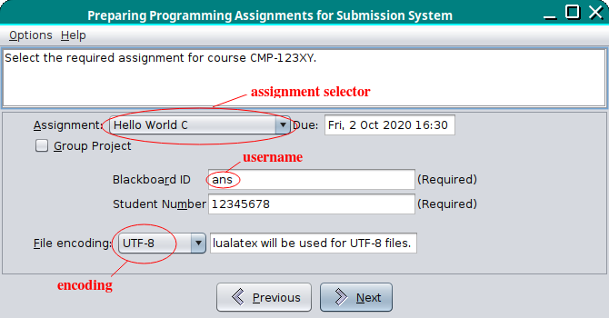
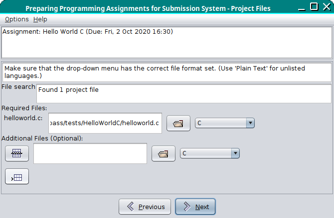

# Compiling the Source Code

[General assumptions as earlier](README.md).

These instructions assume a Unix-like system. I'm sorry, I can't
help with Windows.

## Summary

 1. Clone the repository.
 2. Copy template files to a filename without the `-template` suffix and edit as appropriate.
 3. Download and install any required third-party libraries listed
    in each "pass" subdirectory README file, if applicable.
 4. Run `make` in each of the "pass" subdirectories.
 5. If Server PASS is required, read the documentation in
    the [`server-pass`](https://github.com/nlct/pass/tree/main/docs/server-pass) directory.

## Setting Up

Alice clones the pass repository by following the 
[GitHub instructions](https://docs.github.com/en/repositories/creating-and-managing-repositories/cloning-a-repository) and then changes into the `pass-lib/lib` directory
and copies the template file.
```bash
cd pass-lib/lib
cp resources.xml-template resources.xml
```
She then uses her favourite text editor to edit this new
`resources.xml` file:
```xml
<?xml version="1.0"?>
<resources>
<courses href="http://cmp.example.com/pass/resources.xml" />
</resources>
```
She then changes into the `java` directory and copies the template
file:
```bash
cd ../java
cp AssignmentProcessConfig.java-template AssignmentProcessConfig.java
```
Alice now needs to decide on a new encryption key that's 16
characters long. For example:
```bash
date | md5sum | cut -c -16
```
She opens `AssignmentProcessConfig.java` in her text editor and
replaces `xxxxxxxxxxxxxxxx` in the value of `KEY_1_16` with her new
key. Since she doesn't have a copy of any pre 1.16 PASS
applications, she doesn't need to worry about `KEY_1_15`.
(If it turns out that Alice is actually a lecturer in CMP at UEA,
then she should contact me, @nlct, for the encryption keys instead,
and that's something she should know how to do without any further
instructions.)

Since PASS was designed for a university that uses Blackboard, the
default textual label for the student's username is "Blackboard ID".
Possibly, Alice decides that this is inappropriate for her university, so
she changes the value of `USER_NAME_LABEL` to `label.username`.

She may also need to change `USER_NAME_REGEX` and `REG_NUM_REGEX`
if those regular expressions aren't appropriate. Similarly, she may
want to change the date formats.

Once Alice has performed all the necessary changes to the template
files, she can create `passlib.jar` and `passguilib.jar`:
```bash
cd ..
make
cd ../pass-gui-lib
make
cd ..
```

## XML Files

In order to use the PASS applications, Alice needs to create some
XML files, but it's useful to have a dummy course for testing all
available features before installing the applications.

Alice copies the file
[`example-xml/dummy-assignments.xml`](https://github.com/nlct/pass/blob/main/example-xml/dummy-assignments.xml)
to `http://cmp.example.com/pass/dummy-assignments.xml`.  She notices
that there are some URLs in this file, so she changes them as
appropriate so as not to overload the `dickimaw-books.com` site.
(She can copy all those dummy files over to her
`http://cmp.example.com/pass/` location or a sub-path of that
location if she likes or she can make up her own files.) Example solutions
to all these dummy assignments can be found in the
[`pass/tests`](https://github.com/nlct/pass/tree/main/tests)
directory (although they may generate errors or warnings).

Next Alice needs to create the remote resources file at
`http://cmp.example.com/pass/resources.xml`. This is the URL that
she put in the `href` attribute in the `courses` element in the
"Setting Up" section above.

Alice decides to use 
[`example-xml/remote-resources.xml`](https://github.com/nlct/pass/blob/main/example-xml/remote-resources.xml) as a template, which she copies
to `http://cmp.example.com/pass/resources.xml`, and then she
makes the appropriate changes to the `href` attributes in this file.
Alice notices that the dummy course (CMP-123XY) has the attribute
`debug="true"`. This means that this course will only be available
for Pass applications run in debug mode.

Later on, Alice will read [`resourcexml.md`](resourcexml.md)
and [`assignmentxml.md`](assignmentxml.md) to learn more about the
syntax of these XML files.

## PASS CLI

The Pass CLI command line application should now be quite
straight-forward to build. (This only needs `passlib.jar` not
`passguilib.jar` and doesn't require any third party libraries.)
```bash
cd pass-cli
make
```
If successful, this will create `../dist/pass-cli.zip`, but it's
likely that Alice will want to test the application first.

There are some example files available in the
[pass-cli/examples](https://github.com/nlct/pass/tree/main/pass-cli/examples)
directory, but they use the dummy assignments file so Alice needs to
make sure that she's followed the instructions in the earlier 
"XML Files" section.

If she has all the XML files in place, including the dummy course,
she can run `pass-cli` on the test files. This can be done with:
```bash
make tests
```
Alice should now have a look in the [`tests/results`](https://github.com/nlct/pass/tree/main/tests/results) directory, which hopefully contains PDF files:
`helloworldgui-abc01xyz.pdf`, `helloworldjava-abc01xyz.pdf`,
`testreadfileinfo-abc01xyz.pdf` and `subdirs-abc01xyz.pdf`.
```bash
ls ../tests/results
```

## PASS GUI

The Pass GUI application requires both `passlib.jar` and
`passguilib.jar`, but additionally requires the third party
[Java Look and Feel Graphics Repository](https://www.oracle.com/java/technologies/java-look-and-feel-graphics-repository.html). This needs to
be [downloaded from Oracle](https://www.oracle.com/java/technologies/java-archive-downloads-java-client-downloads.html#7520-jlf-1.0-oth-JPR). The file
`jlfgr-1_0.jar` needs to be copied to the [`pass-gui/lib`](https://github.com/nlct/pass/tree/main/pass-gui/lib) directory (or use a symlink).
For example, if the `jlfgr-1_0.jar` file has been installed in
`/usr/share/java/`:
```bash
cd pass-gui/lib
ln -s /usr/share/java/jlfgr-1_0.jar
cd ..
```

Once this is done, Alice can run `make` in the `pass-gui` directory.
This will compile the source code and, if successful, will also run
Pass GUI in debug mode for testing.

(The JAR file in this case is `progassignsys.jar` which doesn't
follow the naming scheme of all the other PASS JAR files. This is
because `progassignsys.jar` was the original and only application
and `progassignsys` was short for "programming assignment system".
Later, it was decided that "PASS" was shorter and snappier, but the
filename remained unchanged.)

If Alice set up multiple courses in her remote `resources.xml` file,
then she will be presented with a dialogue box from which she can
select her preferred course. If only the dummy course is currently
available, it will be selected automatically.

The interface consists of a top panel that initially just shows the
course code (CMP-123XY) and a bottom panel with the buttons to move
on to the next or previous panel (or "page"). The middle panel contains the
important stuff that changes from one page to the next.

The first page to be displayed is the boring one, that contains the
following text:

> PASS GUI is designed to help you **prepare** programming assignments for submission. It's your responsibility to ensure that the generated PDF correctly represents your work, and it's your responsibility to ensure that you submit the PDF in a timely manner. **If you encounter any problems with PASS GUI please inform your lecturer before you submit your work.**
> PASS FAQ: <https://www.dickimaw-books.com/software/pass/faq.php>

(The above text is supplied in the `message.confirm_blurb` property in the
[`pass-gui/lib/dictionary/progassignsys-en.xml`](https://github.com/nlct/pass/blob/main/pass-gui/lib/dictionary/progassignsys-en.xml) file.)
This is then followed by a checkbox with the following text:

> I/We agree that by submitting a PDF generated by PASS I am/we are confirming that I/we have checked the PDF and that it correctly represents my/our submission. 

(This text is supplied in the `message.i_we_confirm` in the shared [`pass-lib/dictionary/passlib-en.xml`](https://github.com/nlct/pass/blob/main/pass-lib/dictionary/passlib-en.xml) file.)

This checkbox must be selected in order to enable the "Next" button.


Alice selects the agreement checkbox and clicks on the now-enabled
"Next" button to move onto the second page.

The top panel now reads:

> Select the required assignment for course CMP-123XY.

The second page has the assignment selector. The default assignment
will be the one closest to its due date, that hasn't yet passed its
due date, or the assignment with the latest due date if they have
all passed their due dates.

Alice decides to try out a C assignment and selects "Hello World C".
The due date (Fri, 2 Oct 2020 16:30) shows in the area next to the
assignment selector. She enters her username `ans` and makes up
a registration number as she doesn't have one.

Below this is the [encoding](https://dickimaw-books.com/blog/binary-files-text-files-and-file-encodings/) selector. There's a choice of US-ASCII,
ISO 8859-1 (Latin 1) and UTF-8. This will need to match the editor/IDE
used to create the source files. Alice selects UTF-8 and notices
that the text next to the selector states that LuaLaTeX will be
used for UTF-8 files.



Alice clicks on "Next" to move to the next page,
which optionally allows a base directory to be selected. If
one is selected, the "Use relative paths" checkbox will be enabled.
If all project files are in a single directory this can be left
unchecked. If the relative directory structure needs to be
preserved, it should be checked.

The top panel has changed to:

> Assignment: Hello World C (Due: Fri, 2 Oct 2020 16:30)

This page has the following text:

> You can optionally set the directory that contains all your assignment files in the above field. If the assignment has required files, PASS GUI will search the directory for them, otherwise you will need to select each file manually using the buttons in the next panel.
> 
> If a relative directory structure must be maintained, click on the 'Use relative paths' checkbox and ensure that the above field is set to the base directory.

Alice selects the [`tests/HelloWorldC`](https://github.com/nlct/pass/tree/main/tests/HelloWorldC) directory.


Alice clicks on "Next" to move to the next page and discovers that
Pass GUI has found the file `helloworld.c` and has added it to the
list of required files. This file is identified in the
`dummy-assignments.xml` file with the `mainfile` element.

There's some information text about file selection:

> Make sure that the drop-down menu has the correct file format set. (Use 'Plain Text' for unlisted languages.)

This is followed by the results of the file search:

> Found 1 project file

(The file search is omitted if no base directory is specified on the
previous page.)

If the assignment has required files, they are listed with the
required name followed by the path of the file that has been
selected. It's important that they match.

This is followed by the additional files section where the student
can specify any additional files that form part of their project.
Normally, the only binary files that they can include are PDF or
Word documents. The file search not only looks for required files
but also looks for any file with an appropriate extension.



Alice clicks on "Next" (and happens to glance at her watch and
notices that it's currently 17:09:55 GMT on the 16th Nov 2022).

A progress bar appears and a transcript window opens up with various messages. 
When the process is finished, a save dialog
pops up with the suggested filename `helloworld-ans.pdf`.
This is formed from the assignment label followed by the
username. Alice saves this file in the
[`tests/results`](https://github.com/nlct/pass/tree/main/tests/results) directory
but notices a temporary directory that starts with `prepasg` that's
mentioned in the transcript and also notices in the transcript that
LuaLaTeX has been run on a file in this directory.

Alice opens this temporary `.tex` file and finds the command
```latex
\pdfinfo{/CreationDate (D:20221116170955Z)
...
}
```
She remembers that the assignment's due date is Fri, 2 Oct 2020 16:30, so
she decides to change the creation date to (D:2020100215005501'00').
Then she finds the line:
```latex
\date{Wed, 16 Nov 2022 17:09}
```
and changes it to:
```latex
\date{Fri, 2 Oct 2020 15:00}
```
She saves the file and runs LuaLaTeX on it and checks the PDF
metadata using `pdfinfo`. This produces the following output:
```
Title:           Hello World C
Subject:         CMP-123XY Assignment Submission
Keywords:        
Author:          ans
Creator:         LaTeX with hyperref
Producer:        LuaTeX-1.15.0
CreationDate:    Fri Oct  2 15:00:55 2020 BST
ModDate:         Wed Nov 16 17:14:15 2022 GMT
Custom Metadata: yes
Metadata Stream: no
Tagged:          no
UserProperties:  no
Suspects:        no
Form:            none
JavaScript:      no
Pages:           3
Encrypted:       no
Page size:       595.276 x 841.89 pts (A4)
Page rot:        0
File size:       44552 bytes
Optimized:       no
PDF version:     1.5
```
Alice notices that the modification date doesn't match the creation
date, so she edits the LaTeX source again so that it also has the
modification date set:
```latex
\pdfinfo{/CreationDate (D:2020100215005501'00')
/ModDate (D:2020100215005501'00')
...
}
```
She then reruns LuaLaTeX and checks the metadata again with `pdfinfo`.
The modification date is now the same as the creation date.

Alice then copies the PDF to
`tests/results/helloworld-ans.pdf`, which overwrites the PDF
that Pass GUI saved, and exits Pass GUI, which deletes the temporary
directory.

## PASS Checker

The Pass Checker application requires [PDF Box](https://pdfbox.apache.org/),
which in turn requires the [Apache Commons Logging](https://pdfbox.apache.org/) library.
PDF Box can be downloaded from Apache or it can be installed using
a software manager. For example, with Fedora:
```bash
sudo dnf install pdfbox
```
Alice does this and then double-checks that Apache Commons Logging
has also been installed:
```bash
sudo dnf info apache-commons-logging
```
She notices that Log4J is mentioned in the description and
[very sensibly checks the version of log4j](https://www.ncsc.gov.uk/information/log4j-vulnerability-what-everyone-needs-to-know) that's installed on her device:
```bash
sudo dnf info log4j
```

Once Alice is satisfied that these libraries are installed and
up-to-date, she then finds the files `commons-logging.jar` and `pdfbox.jar`
in the directory `/usr/share/java/` and creates symlinks to them in
the [`pass-checker/lib`](https://github.com/nlct/pass/tree/main/pass-checker/lib)
directory and runs `make test` to compile the Pass Checker code and
run a test.
```bash
cd pass-checker/lib
ln -s /usr/share/java/commons-logging.jar
ln -s /usr/share/java/pdfbox.jar
cd ..
make test
```
This runs Pass Checker on all the PDF files in the `tests/results`
directory. The output is TAB separated with the following fields:

 - PDF Filename
 - Author (the student's username)
 - Author Check (this should be identical to the Author field)
 - Date Check (the date PASS created the PDF)
 - Creation Date (the PDF creation date)
 - Mod Date (the PDF modification date)
 - PASS Version (the version of PASS that created the PDF)
 - Application (the PASS application that created the PDF)
 - Submission Date (Server PASS Only)
 - Notes

Alice notices that the `helloworld-ans.pdf` file she tampered with when
testing Pass GUI has the timestamp in the Date Check field shown
as "2022-11-16 17:09:55", which was the date Pass GUI created the
source code for the PDF file. The Creation Date and Mod Date fields
show her altered value of "2020-10-02 15:00:55". The Notes field
has the following information:

> Mismatched creation date.  
> Modification date <= creation date.  
> Late submission.

Even though Alice modified all the dates that she could find in the LaTeX
source code and added a modification date to a time before the due
date, Pass Checker has flagged this PDF as a late submission
with a dubious creation date and modification date.

The modification date is always expected to be some time after the
creation date. The creation date corresponds to the time that PASS
started to create the LaTeX document source code. The modification time is the time
at which LaTeX starts compiling the document source code. In between
those two times, PASS has to copy all the project files, create the
zip attachment and (if applicable) compile and run the student's
application, as well as finish writing the LaTeX source code.

Pass Checker knows the real creation date because its
encrypted value is stored in one of the custom metadata fields.
This can't be altered without knowing the encryption key.

## PASS Editor

The Pass Editor application requires both `passlib.jar` and
`passguilib.jar`, but additionally requires the
[Java Look and Feel Graphics Repository](https://www.oracle.com/java/technologies/java-look-and-feel-graphics-repository.html) (as for Pass GUI) and also
the [JavaHelp](https://github.com/javaee/javahelp/) library.
The JavaHelp repository has been archived, which suggests it may
now be obsolete, so this library may have to be replaced with an alternative.
(This is something I will investigate.)
For now, you may be able to install it via your software manager.
For example:
```bash
sudo dnf install javahelp2
```

Alice has already installed `jlfgr-1_0.jar` earlier, when she tested
Pass GUI, so she just needs to install JavaHelp now and then create
symlinks:
```bash
cd pass-editor/lib
ln -s /usr/share/java/javahelp2.jar
ln -s /usr/share/java/jlfgr-1_0.jar
cd ..
make
```
As with Pass GUI, `make` without a target will compile the source
code and the documentation, and then run the application so that 
it can be tested.

The source code for the documentation is in an XML file
[`pass-editor/doc/passeditor-en.xml`](https://github.com/nlct/pass/blob/main/pass-editor/doc/passeditor-en.xml).
The [`createpasseditordocs`](https://github.com/nlct/pass/blob/main/pass-editor/doc/createpasseditordocs) Perl script in the same directory creates both
the LaTeX source code and the JavaHelp code from the XML file.

## Server PASS

The Server Pass application is a minor modification to Pass CLI that
allows a submission time and job ID to be provided. This is intended for use on
a server where the project files are uploaded via a website and the
website creates the file that contains the project data and the
submission time. The job is queued and a backend script picks up the
job information and runs the `pass-cli-server` application in a
Docker container.

The source code for the `pass-cli-server` Java application is in
the `pass-cli-server/java` directory. The code can be compiled
using `make` or compiled and tested using `make tests`, which runs
`pass-cli-server` on each of the test files in the `examples`
subdirectory. As with the Pass CLI examples, these all use
assignments from the dummy course.

The website and backend are more complicated. See the documentation in
the [`server-pass`](https://github.com/nlct/pass/tree/main/docs/server-pass) directory.

---

 - Prev: [README](readme.md)
 - Next: [Installing](install.md)
