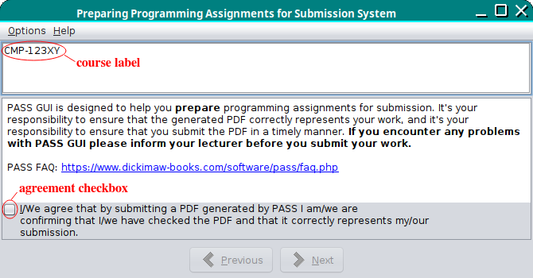
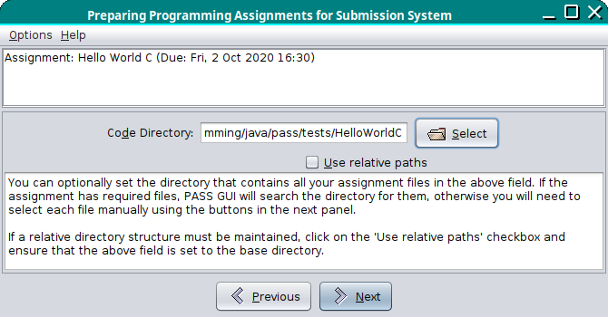

# Compiling the Source Code

[General assumptions as earlier](README.md).

These instructions assume a Unix-like system. I'm sorry, I can't
help with Windows.

## Setting Up

Alice clones the pass repository by following the 
[GitHub instructions](https://docs.github.com/en/repositories/creating-and-managing-repositories/cloning-a-repository) and then changes into the `pass-lib/lib` directory
and copies the template file.
```bash
cd pass-lib/lib
cp resources.xml-template resources.xml
```
She then uses her favourite text editor to edit this new
`resources.xml` file:
```xml
<?xml version="1.0"?>
<resources>
<courses href="http://cmp.example.com/pass/resources.xml" />
</resources>
```
She then changes into the `java` directory and copies the template
file:
```bash
cd ../java
cp AssignmentProcessConfig.java-template AssignmentProcessConfig.java
```
Alice now needs to decide on a new encryption key that's 16
characters long. For example:
```bash
date | md5sum | cut -c -16
```
She opens `AssignmentProcessConfig.java` in her text editor and
replaces `xxxxxxxxxxxxxxxx` in the value of `KEY_1_16` with her new
key. Since she doesn't have a copy of any pre 1.16 PASS
applications, she doesn't need to worry about `KEY_1_15`.
(If it turns out that Alice is actually a lecturer in CMP at UEA,
then she should contact me, @nlct, for the encryption keys instead,
and that's something she should know how to do without any further
instructions.)

Since PASS was designed for a university that uses Blackboard, the
default textual label for the student's username is "Blackboard ID".
Possibly, Alice decides that this is inappropriate for her university, so
she changes the value of `USER_NAME_LABEL` to `label.username`.

She may also need to change `USER_NAME_REGEX` and `REG_NUM_REGEX`
if those regular expressions aren't appropriate. Similarly, she may
want to change the date formats.

Once Alice has performed all the necessary changes to the template
files, she can create `passlib.jar` and `passguilib.jar`:
```bash
cd ..
make
cd ../pass-gui-lib
make
cd ..
```

## XML Files

In order to use the PASS applications, Alice needs to create some
XML files, but it's useful to have a dummy course for testing all
available features before installing the applications.

Alice copies the file [`example-xml/dummy-assignments.xml`](https://github.com/nlct/pass/blob/main/example-xml/dummy-assignments.xml) to
`http://cmp.example.com/pass/dummy-assignments.xml`.
She notices that there are some URLs in this file, so she changes
them as appropriate so as not to overload the `dickimaw-books.com`
site. (She can copy all those dummy files over to her
`http://cmp.example.com/pass/` location if she likes or she can
make up her own files.) Solutions to all these dummy assignments 
can be found in the [`pass/tests`](https://github.com/nlct/pass/tree/main/tests) directory.

Next Alice needs to create the remote resources file at
`http://cmp.example.com/pass/resources.xml`. This is the URL that
she put in the `href` attribute in the `courses` element in the
"Setting Up" section above.

Alice decides to use 
[`example-xml/remote-resources.xml`](https://github.com/nlct/pass/blob/main/example-xml/remote-resources.xml) as a template, which she copies
to `http://cmp.example.com/pass/resources.xml`, and then she
makes the appropriate changes to the `href` attributes in this file.
Alice notices that the dummy course (CMP-123XY) has the attribute
`debug="true"`. This means that this course will only be available
for Pass applications run in debug mode.

## PASS CLI

The Pass CLI command line application should now be quite
straight-forward to build. (This only needs `passlib.jar` not
`passguilib.jar`.)
```bash
cd pass-cli
make
```
If successful, this will create `../dist/pass-cli.zip`, but it's
likely that Alice will want to test the application first.

There are some example files available in the
[pass-cli/examples](https://github.com/nlct/pass/tree/main/pass-cli/examples)
directory, but they use the dummy assignments file so Alice needs to
make sure that she's followed the instructions in the earlier 
"XML Files" section.

If she has all the XML files in place, including the dummy course,
she can run `pass-cli` on the test files. This can be done with:
```bash
make tests
```
Alice should now have a look in the [`tests/results`](https://github.com/nlct/pass/tree/main/tests/results) directory, which hopefully contains PDF files:
`helloworldgui-abc01xyz.pdf`, `helloworldjava-abc01xyz.pdf`,
`testreadfileinfo-abc01xyz.pdf` and `subdirs-abc01xyz.pdf`.
```bash
ls ../tests/results
```

## PASS GUI

The Pass GUI application requires both `passlib.jar` and
`passguilib.jar`, but additionally requires the third party
[Java Look and Feel Graphics Repository](https://www.oracle.com/java/technologies/java-look-and-feel-graphics-repository.html). This needs to
be [downloaded from Oracle](https://www.oracle.com/java/technologies/java-archive-downloads-java-client-downloads.html#7520-jlf-1.0-oth-JPR). The file
`jlfgr-1_0.jar` needs to be copied to the [`pass-gui/lib`](https://github.com/nlct/pass/tree/main/pass-gui/lib) directory (or use a symlink).

Once this is done, Alice needs to change to the `pass-gui` directory
and run `make`. This will compile the source code and, if
successful, will also run Pass GUI in debug mode.

If Alice set up multiple courses in her remote `resources.xml` file,
then she will be presented with a dialogue box from which she can
select her preferred course. If only the dummy course is currently
available, it will be selected automatically.

The interface consists of a top panel that initially just shows the
course code (CMP-123XY) and a bottom panel with the buttons to move
on to the next or previous panel. The middle panel contains the
important stuff that changes from one "page" to the next.

The first page to be displayed is the boring one, that contains the
following text:

> PASS GUI is designed to help you **prepare** programming assignments for submission. It's your responsibility to ensure that the generated PDF correctly represents your work, and it's your responsibility to ensure that you submit the PDF in a timely manner. **If you encounter any problems with PASS GUI please inform your lecturer before you submit your work.**
> PASS FAQ: <https://www.dickimaw-books.com/software/pass/faq.php>

(The above text is supplied in the `message.confirm_blurb` property in the
[`pass-gui/lib/dictionary/progassignsys-en.xml`](https://github.com/nlct/pass/blob/main/pass-gui/lib/dictionary/progassignsys-en.xml) file.)
This is then followed by a checkbox with the following text:

> I/We agree that by submitting a PDF generated by PASS I am/we are confirming that I/we have checked the PDF and that it correctly represents my/our submission. 

(This text is supplied in the `message.i_we_confirm` in the shared [`pass-lib/dictionary/passlib-en.xml`](https://github.com/nlct/pass/blob/main/pass-lib/dictionary/passlib-en.xml) file.)

This checkbox must be selected in order to enable the "Next" button.



Alice selects the agreement checkbox and clicks on the now-enabled
"Next" button.

The second page has the assignment selector. The default assignment
will be the one closest to its due date, that hasn't yet passed its
due date, or the assignment with the latest due date if they have
all passed their due dates.

Alice decides to try out a C assignment and selects "Hello World C".
She enters her username "ans" and makes up a registration number as
she doesn't have one.

There's a message about being allowed to submit accompanying
documents:

> You may include PDF, DOC or DOCX files with your submission. These will be added as attachments. In the case of PDF files, if you additionally want them included directly in the document with \includepdf, provided by the pdfpages package (http://ctan.org/pkg/pdfpages), then make sure the check box below is selected. (Not available for PDF files that contain spaces in the filename.)

There's a checkbox that indicates whether or not to use pdfpages and
the options to use with that package. (I'm considering removing this
from Pass GUI and just having it in the XML file.)

Below this is the encoding selector. There's a choice of US-ASCII,
ISO 8859-1 (Latin 1) and UTF-8. This will need to match the editor
used to create the source files. Alice selects UTF-8 and notices
that the text next to the selector states that LuaLaTeX will be
used.


Alice clicks on "Next" to move to the next page,
which optionally allows a base directory to be selected. If
one is selected, the "Use relative paths" checkbox will be enabled.
If all project files are in a single directory this can be left
unchecked. If the relative directory structure needs to be
preserved, it should be checked.

The top panel has changed to:

> Assignment: Hello World C (Due: Fri, 2 Oct 2020 16:30)

This page has the following text:

> You can optionally set the directory that contains all your assignment files in the above field. If the assignment has required files, PASS GUI will search the directory for them, otherwise you will need to select each file manually using the buttons in the next panel.
> 
> If a relative directory structure must be maintained, click on the 'Use relative paths' checkbox and ensure that the above field is set to the base directory.

Alice selects the [`tests/HelloWorldC`](https://github.com/nlct/pass/tree/main/tests/HelloWorldC) directory.



Alice clicks on "Next" to move to the next page and discovers that
Pass GUI has found the file `helloworld.c` and has added it to the
list of required files. This file is identified in the
`dummy-assignments.xml` file with the `mainfile` element.

There's some information text about file selection:

> Make sure that the drop-down menu has the correct file format set. (Use 'Plain Text' for unlisted languages.)

This is followed by the results of the file search:

> Found 1 project file

(The file search is omitted if no base directory is specified on the
previous page.)

If the assignment has required files, they are listed with the
required name followed by the path of the file that has been
selected. It's important that they match.

This is followed by the additional files section where the student
can specify any additional files that form part of their project.
Normally, the only binary files that they can include are PDF or
Word documents.


Alice clicks on "Next". The top panel shows a progress bar and
a transcript window opens up with various messages. A save dialog
pops up with the suggested filename `helloworld-12345678.pdf`.
This is formed from the assignment label followed by the student
registration number. Alice saves this file in the
[`tests/results`](https://github.com/nlct/pass/tree/main/tests/results) directory
but notices a temporary directory that starts with `prepasg` that's
mentioned in the transcript and also notices in the transcript that
LuaLaTeX has been run on a file in this directory.

Alice opens this temporary `.tex` file and finds the command
```latex
\pdfinfo{/CreationDate (D:20221115223510Z)
...
}
```
She remembers that the assignment's due date is Fri, 2 Oct 2020 16:30, so
she decides to change the creation date to (D:20201002150010+0100).
Then she finds the line:
```latex
\date{Tue, 15 Nov 2022 22:35}
```
and changes it to:
```latex
\date{Fri, 2 Oct 2020 15:00}
```
She saves the file and runs LuaLaTeX on it then copies the resulting PDF to
`tests/results/helloworld-12345678.pdf`, which overwrites the PDF
that Pass GUI saved.
