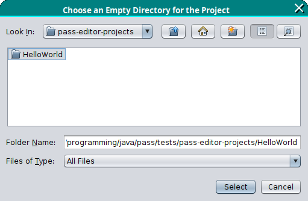
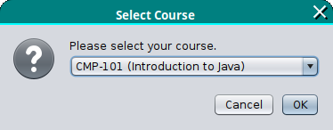
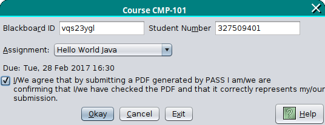
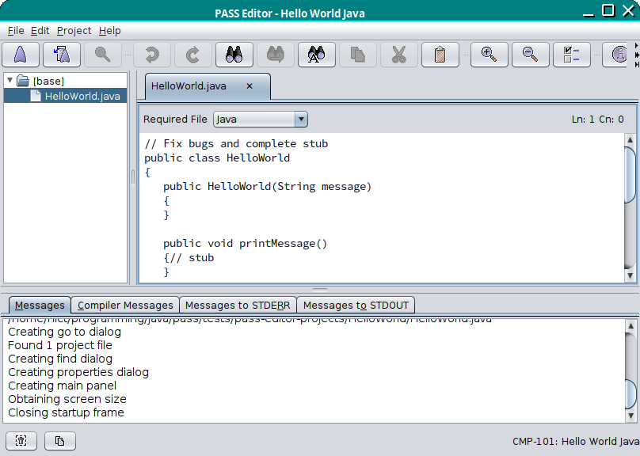
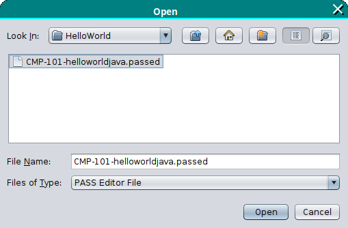
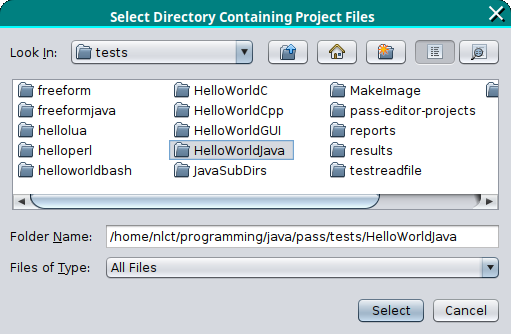
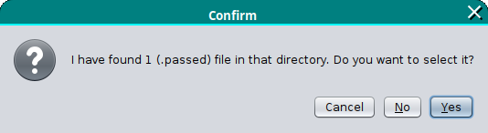
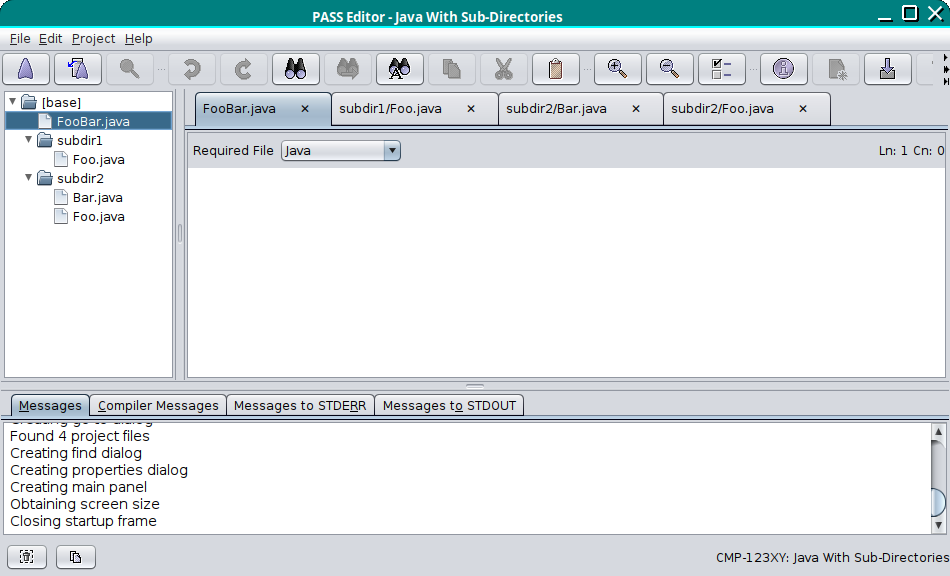
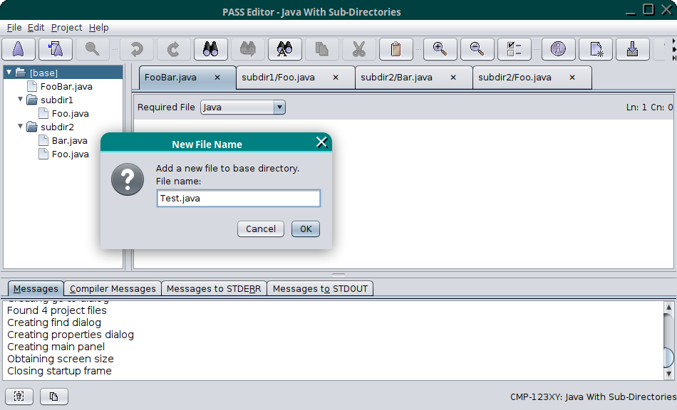

# Pass Editor User Guide

If Pass Editor was installed with the [`pass-editor-installer.jar` installer](install.md)
then it can be run from the Start menu. Note that this will run
Pass Editor in non-debug mode. If the only course in the `resources.xml` file
has `debug="true"` then no courses will be available.

Alternatively, Pass Editor can be run from the command line:
```bash
java -jar /path/to/PASS-Editor/lib/pass-editor.jar
```
where `/path/to/PASS-Editor` is the path to the Pass Editor installation.
Alternative, for Linux or Mac you can use the bash script in the
`bin` directory:
```bash
/path/to/PASS-Editor/bin/pass-editor
```
Add the `--debug` switch to make the test course available.

## Startup

On startup, a dialog will be shown where you need to indicate if you
want to start a new project, open an existing project or import
source code that you have already started into a new project.

> Select Project  
>     
> ---  
>  
> If you have already edited your code in PASS Editor, select 'Open existing project' to continue editing it. If you have already written some source code in another editor, select 'Import assignment data' to import the PASS assignment data. Otherwise select 'New project'.  
>  
> &#x1F518; New Project  
> &#x1F518;&#xFE0E; Open existing project  
> &#x1F518;&#xFE0E; Import assignment data  
> <kbd>Okay</kbd> <kbd>Exit</kbd> <kbd>Help</kbd>


### New Project

Select "New Project" in the initial dialog box and click on "Okay" to
continue. You will then be presented with a file selector to select
a directory to work in. This needs to be an empty directory.
Depending on the Java Look and Feel, you may be able to create a new
directory from this window.

> Choose an Empty Directory for the Project   
>  
> ---  
>  
> 📂 `HelloWorld`  
> <kbd>Select</kbd> <kbd>Cancel</kbd>



Once you have selected an empty directory, the course selector
dialog box will be displayed. If no courses are available an error
will occur.

> Select Course  
>  
> ---  
>  
> Please select your course  
> <kbd>CMP-101 (Introduction to Java)⏷</kbd>  
> <kbd>Cancel</kbd> <kbd>OK</kbd>



Select your course and click on "OK" to continue. This will open a
dialog box to select the assignment. Pass Editor shares its settings
with Pass GUI, so if you have previously used Pass GUI, Pass Editor
will automatically fill in your username and registration number. As
with Pass GUI, there's an agreement checkbox that you must select in
order to enable the "Okay" button.

> Course CMP-101  
>  
> ---  
>  
> Blackboard ID `vqs23ygl` Student Number `327509401`  
> Assignment: <kbd>Hello World Java⏷</kbd>  
> Date: Tue, 28 Feb 2017 16:30  
> ☑ I/We agree that by submitting a PDF generated by PASS I am/we are confirming that I/we have checked the PDF and that it correctly represents my/our submission.  
> <kbd>Okay</kbd> <kbd>Cancel</kbd> <kbd>Exit</kbd> <kbd>Help</kbd>



Click "Okay" to continue, click "Cancel" to return to the original
"Select Project" dialog, or click "Exit" to exit Pass Editor.

This particular assignment requires a file called `HelloWorld.java`
but has provided a template to use as a starting point. Pass Editor
fetches the template and creates `HelloWorld.java`. The main window
is opened with the `HelloWorld.java` file open in a tab.



This will automatically create a file with the extension `.passed`
in the same directory. The basename is formed from the course code
(`CMP-101` in this case), a hyphen, and the assignment label (`helloworldjava`
in this case). This file is a text file that contains all the
information about the project so that you don't have to go through
all the startup dialog boxes if you have to quit and restart Pass
Editor.

### Open Existing Project

If you want to continue working on a project that you have already
started working on in Pass Editor, select the "Open existing
project" option in the initial "Select Project" dialog box and click
"Okay".

This will open a file selector which you can use to select the
`.passed` file.

> Open   
> 📄 `CMP-101-helloworldjava.passed`  
> <kbd>Open</kbd> <kbd>Cancel</kbd>



Click on "Open" and the main Pass Editor window will open.

### Import Assignment Data

If you have already started work on an assignment outside of Pass
Editor, you can import the files. Select the "Import assignment data"
option in the initial "Select Project" dialog box and click "Okay".

This will open a directory selector dialog to select the directory
the files are in.

> Select Directory Containing Project Files     
> 📂 `HelloWorldJava`  
> <kbd>Select</kbd> <kbd>Cancel</kbd>



Click "Select" to continue. If Pass Editor finds a `.passed` file in
that directory, it will ask if you want to select it. This is useful
if you accidentally selected "Import assignment data" instead of
"Open existing project".

> Confirm  
> I have found 1 (.passed) file in that directory. Do you want to
> select it?  
> <kbd>Cancel</kbd> <kbd>No</kbd> <kbd>Yes</kbd>



If you click "Cancel" you will return to the initial "Select Project" dialog box.
If you click "Yes", it will behave as for "Open existing project".
If you click "No", it will go ahead with the normal import action.

Next the assignment selection dialog box will open, as for "New
Project". Select the assignment, make sure that you username and
registration number are correct, and select the agreement checkbox,
as for "New Project".

Note that if you import assignment data and you have already created
a template file, the template won't be fetched.

## Main Window

The main Pass Editor window consists of three areas:

 1. The file navigation panel on the left.
 2. The tabbed editor panes to the right.
 3. The message area at the bottom.

### File Navigation Panel

The file navigation panel is on the left of the main window and has a tree structure
that only shows project files. The root is labelled "[base]",
which represents the base directory that the project resides in.

The following example is for a project that has the following
required files:

  - `FooBar.java`
  - `subdir1/Foo.java`
  - `subdir2/Bar.java`
  - `subdir2/Foo.java`

These files and the sub-directories `subdir1` and `subdir2` are
created automatically by Pass Editor. The files will either be empty
or obtained from a template. The navigation panel shows the file
listings in a tree structure.

  -⏷ 📂 [base]
    - 📄 `FooBar.java`
    - ⏷📂 `subdir1` 
      - 📄 `Foo.java`
    - ⏷📂 `subdir2` 
      - 📄 `Bar.java`
      - 📄 `Foo.java`



To add a new file, select the parent directory (or "[base]" for the
project directory) and open the context popup menu or use the
"Project" menu on the menu bar. Select "New File..." to create a new
file in that directory or "New Folder..." to create a new folder in
that directory.

In the example below, the "[base]" directory was selected and then
the menu item Project ⏵ New File... This opens a dialog box for the
filename.

> New File Name  
>  
> ---  
>  
> Add a new file to base directory.  
> File name:  
> `Test.java`  
> <kbd>Cancel</kbd> <kbd>OK</kbd>



Enter the filename and click on "OK" to create the file and open it
in the editor pane.

You can use the navigation tree to move, rename or delete additional
files but not required files. If a file has been edited outside of
Pass Editor, you can reload it by selecting the file and then use
the menu item Project ⏵ Reload.

If you reload a file that was fetched from a template, you will be
asked to confirm if you want to re-download the template (which will
revert the file back to the start) or if you simply want to reload
your local copy of the file.

  - Select "No" to simply reload a local copy of the file.
  - Select "Yes" to download the template and overwrite your
    local copy (your existing local file will be copied to
    a backup).
  - Select "Cancel" to cancel reload.

### Editor Tabbed Pane

The tabbed editor pane is on the right of the main window. By
default, when you start a project, all required files will be
created and opened.

The following types of file tabs are available:

  - Required files (can be edited, can't be deleted, renamed or moved);
  - Additional files (can be edited, deleted, renamed or moved);
  - Resource files (can't be edited, deleted, renamed or moved);
  - Allowed binary files (can't be edited as they're not text
    files).


### The Message Area

The message area is at the bottom of the main window. This has four
tabs: general messages, compiler messages, messages to STDERR, and
messages to STDOUT. Below the message area is the status bar that contains two buttons
on the left and the course code and assignment title on the right.

The buttons are:

 - Clear all messages;
 - Copy messages in the currently selected message tab to the
   clipboard.

In the middle of the status bar, a progress bar will show when a process
starts running with an abort button. This is the same process panel
used in Pass GUI.

### Messages Area

🚧

---

 - Prev: User Guides ⏵ [Pass GUI](passgui.md)
 - Next: User Guides ⏵ [Pass CLI](passcli.md)
