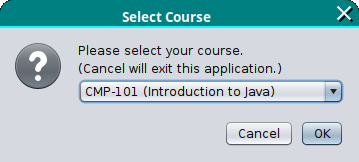
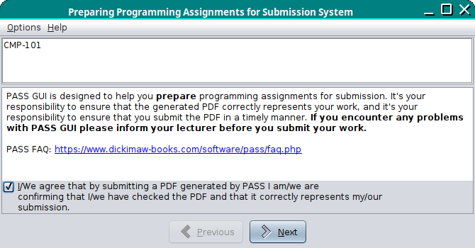
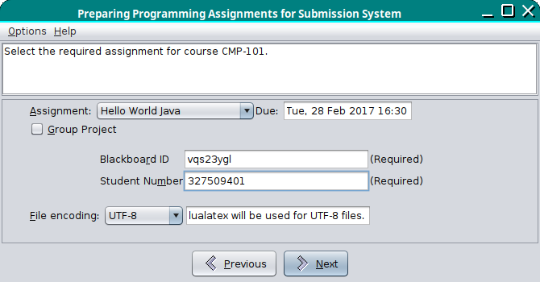
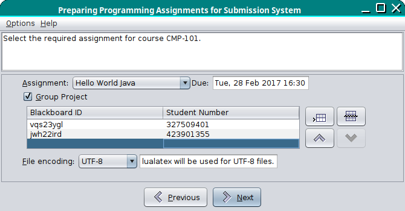
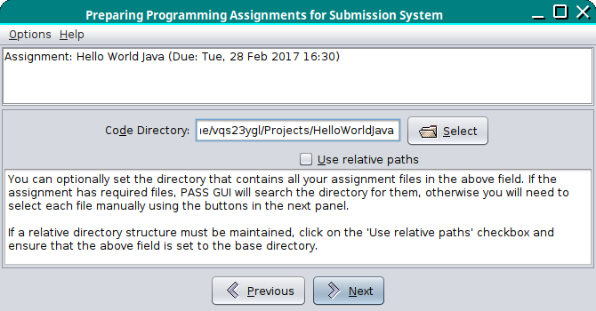

# Pass GUI User Guide

If Pass GUI was installed with the [`pass-installer.jar` installer](install.md)
then it can be run from the Start menu. Note that this will run
Pass GUI in non-debug mode. If the only course in the `resources.xml` file
has `debug="true"` then no courses will be available, which will
generate the error "No course data provided".

Pass GUI can also be invoked from the command line:
```bash
java -jar /path/to/PASS/lib/progassignsys.jar
```
where `/path/to/PASS` is the path to the Pass GUI installation.
Alternative, for Linux or Mac you can use the bash script in the
`bin` directory:
```bash
/path/to/PASS/bin/progassignsys
```
Add the `--debug` switch to make the test course available.

## Course Selection

If only one course is available, that course will be selected
automatically, otherwise the user will be presented with a dialog
box and a dropdown menu to select the required course. In the
example below, the course "CMP-101" has been selected.

> Please select your course.  
> (Cancel will exit this application.)  
> CMP-101 (Introduction to Java)



The "Cancel" button will quit Pass GUI, otherwise select the desired
course and click on "OK".

If you get the following error message:

> Fatal Error: Unable to access _URL_. HTTP response code: 301.

(or a similar 3xx response code) then the URL specified in the XML
file wasn't the actual address but a URL that redirects to another
file. (This includes a redirect from `http:` to `https:`.) If the
response code is 404 then the URL is incorrect. The
`href` value must be corrected to ensure a 200 response code.

## Agreement

If the assignment XML file is successfully fetched, the Pass GUI
window will be opened on the first page, that contains a reminder
that the PDF created by PASS has to be checked and submitted as well
as a link to the FAQ and an agreement checkbox, which must be
checked to enable the "Next" button. The top panel shows the course
label, which in the image below is "CMP-101".

> CMP-101  
>  
> ---  
>  
> PASS GUI is designed to help you **prepare** programming assignments for submission. It's your responsibility to ensure that the generated PDF correctly represents your work, and it's your responsibility to ensure that you submit the PDF in a timely manner. **If you encounter any problems with PASS GUI please inform your lecturer before you submit your work.**  
>  
> PASS FAQ: <https://www.dickimaw-books.com/software/pass/faq.php>  
>  
> ☐ I/We agree that by submitting a PDF generated by PASS I am/we are confirming that I/we have checked the PDF and that it correctly represents my/our submission.



Once you have selected the checkbox, click on the "Next" button to
move on to page 2.

## Assignment Selection

Page 2 has the assignment selector. Select your project assignment
title from the dropdown box. Next to this box is the date that the
project is due.

Below the assignment selector is the student details area. If this
is the first time you have used Pass GUI, you will need to enter
your username and registration number. These will be remembered and
automatically filled in the next time you use Pass GUI.

The example below is for a solo assignment.

> Select the required assignment for course CMP-101.  
>  
> ---  
>  
> Assignment: Hello World Java Due: Tue, 28 Feb 2017 16:30  
> ☐ Group project  
> Blackboard ID: `vqs23ygl` (Required)  
> Student Number: 327509401 (Required)  
>   
> File encoding: UTF-8 lualatex will be used for UTF-8 files.



If your assignment is a group project, check the "Group project"
checkbox, which will switch to a table layout where you can identify
all the members of your group.

> Select the required assignment for course CMP-101.  
>  
> ---  
>  
> Assignment: Hello World Java Due: Tue, 28 Feb 2017 16:30  
> ☑ Group project  
> | Blackboard ID | Student Number |
> | --- | --- |
> | `vqs23ygl` | 327509401 |
> | `jwh22ird` | 423901355 |
>   
> File encoding: UTF-8 lualatex will be used for UTF-8 files.



The file encoding selector provides a choice of: UTF-8, Latin 1 or
ASCII. Make sure that it matches the [encoding](https://dickimaw-books.com/blog/binary-files-text-files-and-file-encodings/) of your source code
files. In general, UTF-8 is the best option.

Click "Next" to move onto page 3.

## Base Directory Selection

Page 3 has the base directory selector. This will be required if the
`relpath` attribute has been set for the assignment. If a relative
path structure isn't required, you can omit it, but it's still
useful as it will allow Pass GUI to search for your project files.

Use the "Select" button to open a directory browser and select the
directory where your project files are. If a relative path structure
is required, ensure that the "Use relative paths" checkbox is
ticked.

The top panel now shows the assignment title and due date. In this
example the base directory has been selected but no relative path
structure is required. This means that all files will be copied over
into the same (temporary) directory.



> Assignment: Hello World Java (Due: Tue, 28 Feb 2017 16:30)  
>  
> ---  
>  
> Code Directory: `/home/vqs23ygl/Projects/HelloWorldJava` 📂 Select  
> ☐ Use relative paths  
>  
> You can optionally set the directory that contains all your assignment files in the above field. If the assignment has required files, PASS GUI will search the directory for them, otherwise you will need to select each file manually using the buttons in the next panel.  
>  
> If a relative directory structure must be maintained, click on the 'Use relative paths' checkbox and ensure that the above field is set to the base directory.


🚧


---

 - Prev: XML File Specifications ⏵ [Assignment Files](assignmentxml.md)
 - Next: User Guides ⏵ [Pass Editor](passeditor.md)
