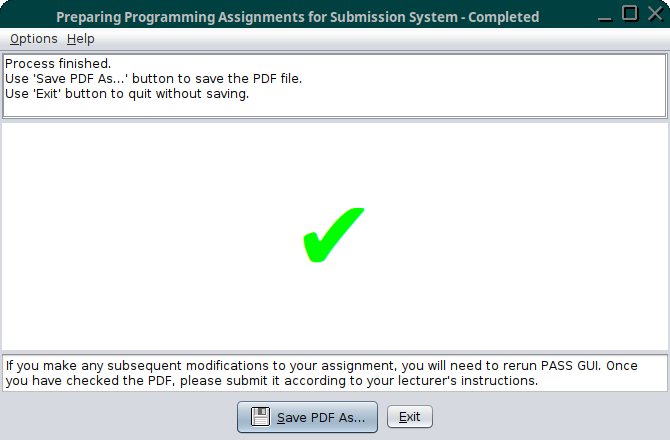

# Pass GUI User Guide

If Pass GUI was installed with the [`pass-installer.jar` installer](install.md)
then it can be run from the Start menu. Note that this will run
Pass GUI in non-debug mode. If the only course in the `resources.xml` file
has `debug="true"` then no courses will be available, which will
generate the error "No course data provided".

Pass GUI can also be invoked from the command line:
```bash
java -jar /path/to/PASS/lib/progassignsys.jar
```
where `/path/to/PASS` is the path to the Pass GUI installation.
Alternative, for Linux or Mac you can use the bash script in the
`bin` directory:
```bash
/path/to/PASS/bin/progassignsys
```
Add the `--debug` switch to make the test course available.

## Course Selection

If only one course is available, that course will be selected
automatically, otherwise the user will be presented with a dialog
box and a dropdown menu to select the required course. In the
example below, the course "CMP-101" has been selected.

> Please select your course.  
> (Cancel will exit this application.)  
> <kbd>CMP-101 (Introduction to Java)⏷</kbd>  
>  
> <kbd>Cancel</kbd> <kbd>OK</kbd>


The "Cancel" button will quit Pass GUI, otherwise select the desired
course and click on "OK".

If you get the following error message:

> Fatal Error: Unable to access _URL_. HTTP response code: 301.

(or a similar 3xx response code) then the URL specified in the XML
file wasn't the actual address but a URL that redirects to another
file. (This includes a redirect from `http:` to `https:`.) If the
response code is 404 then the URL is incorrect. The
`href` value must be corrected to ensure a 200 response code.

## Agreement

If the assignment XML file is successfully fetched, the Pass GUI
window will be opened on the first page. This contains a reminder
that the PDF created by PASS has to be checked and submitted as well
as a link to the
[FAQ](https://www.dickimaw-books.com/software/pass/faq.php) and an
agreement checkbox, which must be checked to enable the "Next"
button. The top panel shows the course label, which in this example
is "CMP-101". The bottom panel has the Previous and Next buttons,
which are initially disabled.

> CMP-101  
>  
> ---  
>  
> PASS GUI is designed to help you **prepare** programming assignments for submission. It's your responsibility to ensure that the generated PDF correctly represents your work, and it's your responsibility to ensure that you submit the PDF in a timely manner. **If you encounter any problems with PASS GUI please inform your lecturer before you submit your work.**  
>  
> PASS FAQ: <https://www.dickimaw-books.com/software/pass/faq.php>  
>  
> ☑ I/We agree that by submitting a PDF generated by PASS I am/we are confirming that I/we have checked the PDF and that it correctly represents my/our submission.  
>  
> ---  
>  
> <kbd>❭ Next</kbd>


Once you have selected the checkbox, click on the "Next" button to
move on to page 2.

## Assignment Selection

Page 2 has the assignment selector. Select your project assignment
title from the dropdown box. Next to this box is the date that the
project is due.

Below the assignment selector is the student details area. If this
is the first time you have used Pass GUI, you will need to enter
your username and registration number. These will be remembered and
automatically filled in the next time you use Pass GUI.

The example below is for a solo assignment.

> Select the required assignment for course CMP-101.  
>  
> ---  
>  
> Assignment: <kbd>Hello World Java⏷</kbd>  Due: Tue, 28 Feb 2017 16:30  
> ☐ Group project  
> Blackboard ID: `vqs23ygl` (Required)  
> Student Number: `327509401` (Required)  
>   
> File encoding: <kbd>UTF-8⏷</kbd> lualatex will be used for UTF-8 files.
>  
> ---  
>  
> <kbd>❬ Previous</kbd>  <kbd>❭ Next</kbd>


If your assignment is a group project, check the "Group project"
checkbox, which will switch to a table layout where you can identify
all the members of your group.

> Select the required assignment for course CMP-101.  
>  
> ---  
>  
> Assignment: <kbd>Hello World Java⏷</kbd> Due: Tue, 28 Feb 2017 16:30  
> ☑ Group project  
> | Blackboard ID | Student Number |
> | --- | --- |
> | `vqs23ygl` | `327509401` |
> | `jwh22ird` | `423901355` |
>   
> File encoding: <kbd>UTF-8⏷</kbd> lualatex will be used for UTF-8 files.
>  
> ---  
>  
> <kbd>❬ Previous</kbd>  <kbd>❭ Next</kbd>

There are buttons next to the table to add a new row, remove the
currently selected row, move the selected row up, and move the
selected row down.


The file encoding selector provides a choice of: US-ASCII, ISO-8859-1 (Latin 1),
or UTF-8. Make sure that it matches the [encoding](https://dickimaw-books.com/blog/binary-files-text-files-and-file-encodings/) of your source code
files. In general, UTF-8 is the best option.

Click "Next" to move onto page 3.

## Base Directory Selection

Page 3 has the base directory selector. This will be required if the
`relpath` attribute has been set for the assignment. If a relative
path structure isn't required, you can omit the base directory, but it's still
useful as it will allow Pass GUI to search for your project files.

Use the "Select" button to open a directory browser and select the
directory where your project files are. If a relative path structure
is required, ensure that the "Use relative paths" checkbox is
ticked.

The top panel now shows the assignment title and due date. In this
example the base directory has been selected but no relative path
structure is required. This means that all files will be copied over
into the same (temporary) directory.

> Assignment: Hello World Java (Due: Tue, 28 Feb 2017 16:30)  
>  
> ---  
>  
> Code Directory: `/home/vqs23ygl/Projects/HelloWorldJava` <kbd>📂 Select</kbd>  
> ☐ Use relative paths  
>  
> You can optionally set the directory that contains all your assignment files in the above field. If the assignment has required files, PASS GUI will search the directory for them, otherwise you will need to select each file manually using the buttons in the next panel.  
>  
> If a relative directory structure must be maintained, click on the 'Use relative paths' checkbox and ensure that the above field is set to the base directory.
>  
> ---  
>  
> <kbd>❬ Previous</kbd>  <kbd>❭ Next</kbd>


## File Selection

Page 4 has the project file selection fields.
If a base directory was selected on the previous page, then Pass GUI
will search for required files and any files with an extension that
matches the project language or, if applicable, one of the allowed binary
extensions. The result of the search will be shown in the "File
search" line. This line will be omitted if no base directory was
selected.

This example has one required file `HelloWorld.java` and it has been
found in the selected directory. The path to this file has been
filled in.

> Assignment: Hello World Java (Due: Tue, 28 Feb 2017 16:30)  
> 
> ---  
>  
> Make sure that the drop-down menu has the correct file format set. (Use 'Plain Text' for unlisted languages.) The only permitted binary files are: .pdf, .doc, .docx  
>   
> File search Found 1 project file  
>  
> Required Files:  
> `HelloWorld.java`: `/home/vqs23ygl/Projects/HelloWorldJava/HelloWorld.java` <kbd>📂</kbd> <kbd>Java⏷</kbd>  
> Additional Files (Optional):  
> <kbd>_Remove Button_</kbd> _empty_ <kbd>📂</kbd> <kbd>Java⏷</kbd>  
> <kbd>_Add Button_</kbd>
>  
> ---  
>  
> <kbd>❬ Previous</kbd>  <kbd>❭ Next</kbd>


Any files that aren't found can be added by clicking on the file
selector button 📂. Next to this is a dropdown menu that specifies
the file's source code language. In this case, it's "Java". If this
is incorrect, you will need to change it to the appropriate
language. Use "PDF" for PDF documents and "DOC" for Word documents.
Any unsupported formats should be identified as "Plain Text".

Normally, the only binary files that are allowed are PDF or Word
documents. A lecturer may allow additional files, such as image
files, if the project requires them.

Suppose Dr Alice Smith has set an assignment to create a GUI
application that requires the students to create image files for the
application icons. Alice instructs PASS to allow PNG and JPEG files.
The file selector panel now has a section for allowed binary files.
(Any PDF or Word reports should be added in the additional files
section with the dropdown menu set to PDF or DOC, as appropriate.)

> Assignment: Hello World GUI (Due: Fri, 2 Dec 2022 16:30)  
> 
> ---  
>  
> Make sure that the drop-down menu has the correct file format set. (Use 'Plain Text' for unlisted languages.) The only permitted binary files are: .pdf, .doc, .docx, .png, .jpeg, .jpg  
>   
> File search Found Found 3 project files  
>  
> Required Files:  
> `HelloWorldGUI.java`: `/home/vqs23ygl/Projects/HelloWorldGUI/HelloWorldGUI.java` <kbd>📂</kbd> <kbd>Java⏷</kbd>  
> Additional Files (Optional):  
> <kbd>_Remove Button_</kbd> _empty_ <kbd>📂</kbd> <kbd>Java⏷</kbd>  
> <kbd>_Add Button_</kbd>
>  
> Binary Files:  
> <kbd>_Remove Button_</kbd> `/home/vqs23ygl/Projects/HelloWorldGUI/icons/sample.png` <kbd>📂</kbd> image/png   
> <kbd>_Remove Button_</kbd> `/home/vqs23ygl/Projects/HelloWorldGUI/icons/logo.png` <kbd>📂</kbd> image/png   
> <kbd>_Add Button_</kbd>
>  
> ---  
>  
> <kbd>❬ Previous</kbd>  <kbd>❭ Next</kbd>

(Note that this example will need the "Use relative paths" setting
selected on the previous page as the images are in a sub-directory.)


Don't include any files that aren't part of your project source code or
that aren't a report. Click the "Next" button once you have checked
that all your files are listed and have had the language correctly
identified. This will move onto page 5 and PASS will start
processing your project.

## Processing

Page 5 shows the progress bar while PASS processes all the selected
files. This will start out in an indeterminate state and will then
switch to an incremental progress bar. On the left of this is an
abort button, which you can click if you want to cancel the process.
There's a maximum time limit for processes, so any that take too
long will timeout.

> Assignment: Hello World Java (Due: Tue, 28 Feb 2017 16:30)  
> 
> ---  
>  
> <kbd>🛑</kbd> [Progress Bar] 00:02
>  
> If you make any subsequent modifications to your assignment, you will need to rerun PASS GUI. Once you have checked the PDF, please submit it according to your lecturer's instructions.


The transcript window will also open. If you close it you, can
reopen it using the Options ⏵ Show Transcript menu item.

If the process finishes successfully, a dialog box will open so that
you can save the PDF. If you accidentally cancel it, there will be a
save button available, which you can click on to reopen the save
dialog. Once the PDF is saved, the button will change to an open
button, which will allow you to view the PDF. Alternatively, you can
open your preferred PDF viewer via the Start menu and view the PDF
with that.

### Successful

In this example, the project was processed successfully.

> Process finished.  
> Use 'Save PDF As...' button to save the PDF file.  
> Use 'Exit' button to quit without saving.  
>  
> ---  
>  
> **✔**  
>  
> If you make any subsequent modifications to your assignment, you will need to rerun PASS GUI. Once you have checked the PDF, please submit it according to your lecturer's instructions.  
>  
> --- 
>  
> <kbd>💾 Save PDF As...</kbd> <kbd>Exit</kbd>



Once you have saved the PDF, you can exit Pass GUI either by
clicking on the "Exit" button or use the window's close icon.
Remember that you will then need to submit the PDF according to your
lecturer's instructions before the due by date.

### Warning (Compiler Error)

In the example below, the source code had errors, which meant the
compile step failed. PASS was therefore unable to run the project
application. However, it did manage to create a PDF file, so a save
dialog is still available to save the result.

There is now not only a button to save or view the PDF but also a
button to view the LaTeX log file. (If you want to save the
transcript messages, do <kbd>Alt</kbd> + <kbd>A</kbd> to select all
the text and <kbd>Alt</kbd> + <kbd>C</kbd> to copy the selected text
to the clipboard. You can then paste it into a text editor.)

> Process finished.  
> Use 'Save PDF As...' button to save the PDF file.  
> Use 'Exit' button to quit without saving.  
> Something went wrong while testing the application. Please check the PDF file.  
>  
> ---  
>  
> **!**  
>  
> If you make any subsequent modifications to your assignment, you will need to rerun PASS GUI. Once you have checked the PDF, please submit it according to your lecturer's instructions.  
>  
> --- 
>  
> <kbd>📂 Open Log</kbd> <kbd>💾 Save PDF As...</kbd> <kbd>Exit</kbd>


The large exclamation mark in this case is yellow, which indicates a
warning.

The transcript window shows messages about each step, including the
compiler error messages that it picked up from reading the process's
STDERR.

```
Timeout: 180s.
Temporary directory: /tmp/prepasg2707696061798360458.
In file included from Planet.cpp:1:
Planet.h:1:1: error: new types may not be defined in a return type
    1 | class Planet
      | ^~~~~
Planet.h:1:1: note: (perhaps a semicolon is missing after the definition of ‘Planet’)
Planet.h:1:1: error: return type specification for constructor invalid
Planet.cpp: In constructor ‘Planet::Planet(const char*)’:
Planet.cpp:5:3: error: ‘strncpy’ was not declared in this scope
    5 |   strncpy(name, planetName, sizeof(name));
      |   ^~~~~~~
Planet.cpp:2:1: note: ‘strncpy’ is defined in header ‘<cstring>’; did you forget to ‘#include <cstring>’?
    1 | #include "Planet.h"
  +++ |+#include <cstring>
    2 | 
In file included from helloworld.cpp:6:
Planet.h:8:2: error: expected ‘;’ after class definition
    8 | }
      |  ^
      |  ;
Something went wrong while testing the application. Please check the PDF file.
This is LuaHBTeX, Version 1.15.0 (TeX Live 2022) 
 restricted system commands enabled.
(./prepasg2707696061798360458.tex
LaTeX2e <2022-11-01>
```


These errors should have been picked up when you were developing and
testing your source code. If you are already aware of these problems
but have run out of time to fix them, then check the PDF to make
sure you haven't missed anything and submit it.

If those errors didn't occur when you were developing and testing
your source code, then it may be because there was some compiler
setting that your lecturer has specified that you didn't use.

For example, Dr Alice Smith has set a C programming assignment that requires a
file called `helloworld.c` that prints "Hello World!" to STDOUT and
the source code must contain a comment line and the source code must
conform to ANSI C (C90).

Bob has written a file `helloworld.c` that successfully writes
"Hello World!" to STDOUT when he tests it in his IDE. However, Bob
has used a C++ style comment line with `//` which isn't permitted with ANSI C.
Bob hasn't used the `-ansi` compiler option in his IDE, so it
compiles and runs fine there. Alice has instructed PASS to use
`-ansi` when compiling the source code for this assignment, which
results in an error that PASS picks up.

The transcript window shows how PASS tried to run the compiler.
```
Running gcc -Wall -o helloworld -ansi helloworld.c 
in directory /tmp/prepasg1042479341129485275
PASS log file: /tmp/prepasg1042479341129485275/PASS_compiler-messages-2390713693280042584.txt
helloworld.c:1:1: error: C++ style comments are not allowed in ISO C90
```

Note that PASS isn't compiling Bob's original `helloworld.c` but has
copied it to a temporary directory, which in this case is
`/tmp/prepasg1042479341129485275`. When PASS runs the compiler, it
redirects STDERR and STDOUT to a temporary file so that it can
include the messages verbatim in the PDF file.

You may find it easier to view the PDF to find this information.
The PDF should have an "Application" section with "Compiler
Invocation" and "Compiler Messages" subsections. Make sure that your
IDE is setup to use the same options, and make the appropriate
corrections to your source code.  You will then need to rerun Pass GUI.

### Error (Invalid Binary Content)

Suppose in the "Hello World Java" example, Bob tried to include an
image file (called `sample.png`). The default file language selector
stays on "Java" and Bob goes ahead and clicks on "Next".

> Assignment: Hello World Java (Due: Tue, 28 Feb 2017 16:30)  
> 
> ---  
>  
> Make sure that the drop-down menu has the correct file format set. (Use 'Plain Text' for unlisted languages.) The only permitted binary files are: .pdf, .doc, .docx  
>   
> File search Found 1 project file  
>  
> Required Files:  
> `HelloWorld.java`: `/home/vqs23ygl/Projects/HelloWorldJava/HelloWorld.java` <kbd>📂</kbd> <kbd>Java⏷</kbd>  
> Additional Files (Optional):  
> <kbd>_Remove Button_</kbd> `/home/vqs23ygl/Projects/HelloWorldJava/sample.png` <kbd>📂</kbd> <kbd>Java⏷</kbd>  
> <kbd>_Add Button_</kbd>
>  
> ---  
>  
> <kbd>❬ Previous</kbd>  <kbd>❭ Next</kbd>


Now the process will fail with a `MalformedInputException` error and
no PDF will be created.

> Process Failed. Temporary files in '/tmp/prepasg1221888218071866729' will be deleted on exit.  
> Something went wrong while testing the application. Please check the PDF file.  
> Something went wrong while compiling the PDF.  
> A binary file may have been added where a text file was expected (or wrong encoding used).  
>  
> ---  
>  
> **!**  
>  
> If you make any subsequent modifications to your assignment, you will need to rerun PASS GUI. Once you have checked the PDF, please submit it according to your lecturer's instructions.  
>  
> --- 
>  
> <kbd>Exit</kbd>

Now the exclamation mark is red.


Pass GUI has suggested two possible reasons for failure:

 1. a binary file was added where a text file was expected;
 2. a text file had an encoding that didn't match the one specified
    in the assignment selection panel.

In this case, the first reason applies. Bob will have to rerun Pass
GUI without selecting the image file. If the lecturer has instructed
PASS to run your application then PASS will capture all messages to
STDOUT and STDERR so there shouldn't be any need to include any
screenshots. If your project stipulated that you need to create
a graphical application, then it's more likely that this will
require an accompanying report rather than just a screenshot. Check
with your lecturer if you really feel a screenshot is required.

If this error occurs with your project and you are sure that you
have only selected text files, then it's probably an encoding
mismatch. For example, a text file with Latin 1 encoding has been
incorrectly identified as a UTF-8 file. You can use the
[`findnonascii.pl`](https://github.com/nlct/pass/blob/main/pass-cli-server/server-files/backend/findnonascii.pl) Perl script to search all your source code files
for non-ASCII content, if you are not sure which files have
non-ASCII characters. Bear in mind that you also need to consider
any characters written to STDOUT/STDERR by any processes run by
PASS.

If you can't work out what's causing the problem, copy and paste the
transcript messages to a text file and consult your lecturer.

---

 - &#x23EE; XML File Specifications ⏵ [Assignment Files](assignmentxml.md)
 - &#x23ED; User Guides ⏵ [Pass Editor](passeditor.md)
 - &#x23F6; [Documentation Summary](README.md)
